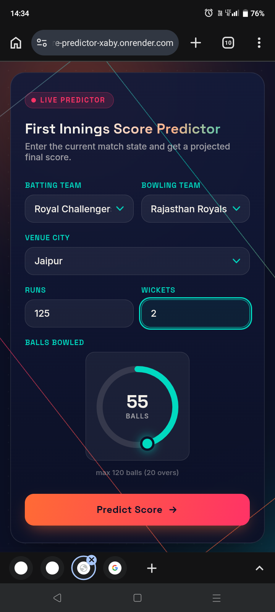

# 🏏 IPL Score Predictor

A machine learning web app that predicts the first-innings final score of an IPL cricket match in real time, based on the current match situation — batting team, bowling team, venue, runs, overs, and wickets.

Built as part of my journey to becoming an **AI/ML Engineer**.

---

## 🎯 Motive

I'm a huge fan of IPL (Indian Premier League) cricket, and I wanted to combine that passion with machine learning. The goal of this project is to predict how many runs a team is likely to finish with in their first innings, using only the data available *during* the match — the kind of live prediction you see on cricket broadcasts.

This project was also a way for me to practice the full ML workflow end-to-end: from raw data, to a trained model, to a deployed web app that anyone can use.

---

## 🖼️ App Preview

<!-- Add a screenshot of your website here.
     1. Take a screenshot of your deployed app (or run it locally and screenshot it).
     2. Save it in this folder as `screenshot.png`.
     3. The line below will then display it automatically on GitHub. -->



---

## ⚙️ How It Works

1. The user selects the **batting team**, **bowling team**, and **venue city**.
2. The user enters the **current score**, **overs bowled**, and **wickets lost**.
3. These inputs are converted into features like current run rate and runs per wicket.
4. A trained regression model predicts the **projected final score** (shown as a range).

---

## 🧰 Tech Stack

### Data Science & Modeling
| Tool | Purpose |
|---|---|
| **NumPy** | Numerical computations |
| **Pandas** | Data cleaning and manipulation |
| **Matplotlib** | Data visualization |
| **Seaborn** | Statistical visualization |
| **Scikit-learn** | Model building, training, and evaluation |

### Development Environments
| Tool | Purpose |
|---|---|
| **Kaggle Notebook** | Online coding, model training, and access to IPL datasets |
| **Pydroid 3** | Offline Python coding on mobile |

### Web App
| Tool | Purpose |
|---|---|
| **Flask** | Backend web framework serving the model |
| **HTML / CSS / JavaScript** | Frontend interface |
| **Render** | Deployment / hosting |

### AI Assistance
| Tool | Purpose |
|---|---|
| **ChatGPT** | Coding helper — debugging, logic, and explanations |
| **Claude** | Website design — modern UI/UX for the frontend |

---

## 🚀 Deployment

The app is deployed live on **Render**.

To run it locally:

```bash
# 1. Clone the repository
git clone <https://github.com/nagendragouda390-lgtm/Cricket-score-predictor-ipl/>
cd ipl-score-predictor

# 2. Install dependencies
pip install flask numpy pandas scikit-learn joblib

# 3. Run the app
python app.py
```

Then open `http://localhost:10000` in your browser.

---

## 📂 Project Structure

```
ipl-score-predictor/
│
├── app.py                     # Flask backend
├── final_score_predictor3.pkl # Trained ML model
├── templates/
│   ├── index.html             # Input form page
│   └── result.html            # Prediction result page
├── static/
│   └── style.css              # Styling
└── README.md
```

---

## 📈 Model

The model is a regression model trained on historical IPL match data using **scikit-learn**, using features such as:

- Batting team
- Bowling team
- Venue (city)
- Current runs
- Balls bowled
- Wickets lost
- Current run rate
- Runs per wicket
- Estimated score (extrapolated run rate × 20 overs)

---

## 🙋 About Me

I'm learning and building projects on my path toward becoming an **AI/ML Engineer**. This project reflects my interest in applying machine learning to real-world domains I care about — starting with cricket.

---

## 📌 Future Improvements

- Add live match data integration via an API
- Improve model accuracy with more recent IPL seasons
- Add second-innings (chasing) score/win predictor
- Add player-level statistics as features
